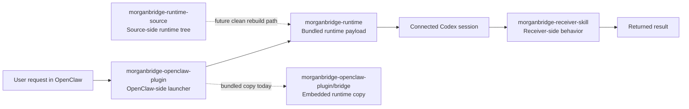

# MorganBridge Stack

Community bridge/plugin stack for OpenClaw and Codex-compatible workflows.

MorganBridge Stack is a third-party integration bundle for handing work from an OpenClaw-side plugin into a connected Codex session through MorganBridge. It packages the current public release in one repository with the runtime, plugin, skill, and supporting documentation kept together.

This project is maintained independently by `morganshen153`. It is not affiliated with, endorsed by, sponsored by, or certified by OpenAI or the OpenClaw project. References to OpenClaw and Codex are used for compatibility and discoverability only.

## What Is Included

- [`morganbridge-openclaw-plugin/`](./morganbridge-openclaw-plugin)  
  OpenClaw-side launcher plugin that invokes MorganBridge and returns results into the originating conversation.
- [`morganbridge-receiver-skill/`](./morganbridge-receiver-skill)  
  Codex-side receiver skill that keeps handoff responses compact, continuous, and task-focused.
- [`morganbridge-runtime-source/`](./morganbridge-runtime-source)  
  Extracted source-side runtime tree prepared for Apache-2.0 publication.
- [`morganbridge-runtime/`](./morganbridge-runtime)  
  Bundled runtime payload currently kept as a distribution artifact while public provenance and rebuild boundaries are being tightened.

## Component Relationship

Today, the stack is published as one umbrella repository. This repository is the current public release channel for the MorganBridge bundle.

## Quick Start

1. Copy [`morganbridge-openclaw-plugin/`](./morganbridge-openclaw-plugin) into `%USERPROFILE%\.openclaw\extensions\morganbridge-openclaw-plugin\`.
2. If your Codex setup supports local skills, place [`morganbridge-receiver-skill/`](./morganbridge-receiver-skill) in your local skills directory.
3. Review the component installation guides before redistribution or customization:
   - [`morganbridge-openclaw-plugin/Installation-Guide.md`](./morganbridge-openclaw-plugin/Installation-Guide.md)
   - [`morganbridge-receiver-skill/Installation-Guide.md`](./morganbridge-receiver-skill/Installation-Guide.md)
4. Treat [`morganbridge-runtime-source/`](./morganbridge-runtime-source) as the source-side reference point, and treat bundled runtime binaries as a separate release boundary until the public build path is fully documented.

## Why This Repository Exists

This repository is the umbrella entry point for the full stack. It gives users one place to:

- discover the project through OpenClaw, Codex, plugin, skill, and bridge search terms
- understand how the plugin, skill, and runtime pieces fit together
- review naming, release-boundary, and licensing notes before reuse
- start from the current public bundle with the release boundary already documented

## Current Public Scope

This repository is the public release you should use. It intentionally keeps the current bundle together instead of publishing separate standalone component repositories.

Use this repo when you want:

- the current published bundle
- the documented release boundary in one place
- the runtime, plugin, skill, and docs to stay aligned in a single public release

## Release Boundary

- Apache-2.0-ready material:
  - [`morganbridge-openclaw-plugin/`](./morganbridge-openclaw-plugin)
  - [`morganbridge-receiver-skill/`](./morganbridge-receiver-skill)
  - [`morganbridge-runtime-source/`](./morganbridge-runtime-source)
- Pending binary/provenance review:
  - [`morganbridge-runtime/`](./morganbridge-runtime)
  - [`morganbridge-openclaw-plugin/bridge/`](./morganbridge-openclaw-plugin/bridge)

See these files for release and compliance details:

- [`LICENSE_SCOPE.md`](./LICENSE_SCOPE.md)
- [`SOURCE_BOUNDARY.md`](./SOURCE_BOUNDARY.md)
- [`THIRD_PARTY_NOTICES.md`](./THIRD_PARTY_NOTICES.md)
- [`OPEN_SOURCE_RISK_REVIEW.md`](./OPEN_SOURCE_RISK_REVIEW.md)
- [`PROJECT_NAMING.md`](./PROJECT_NAMING.md)

## License

This project is released under the Apache License, Version 2.0 for the material identified as Apache-2.0-ready above. See [`LICENSE`](./LICENSE) for the full license text, and review the release-boundary documents before redistributing bundled runtime artifacts.
